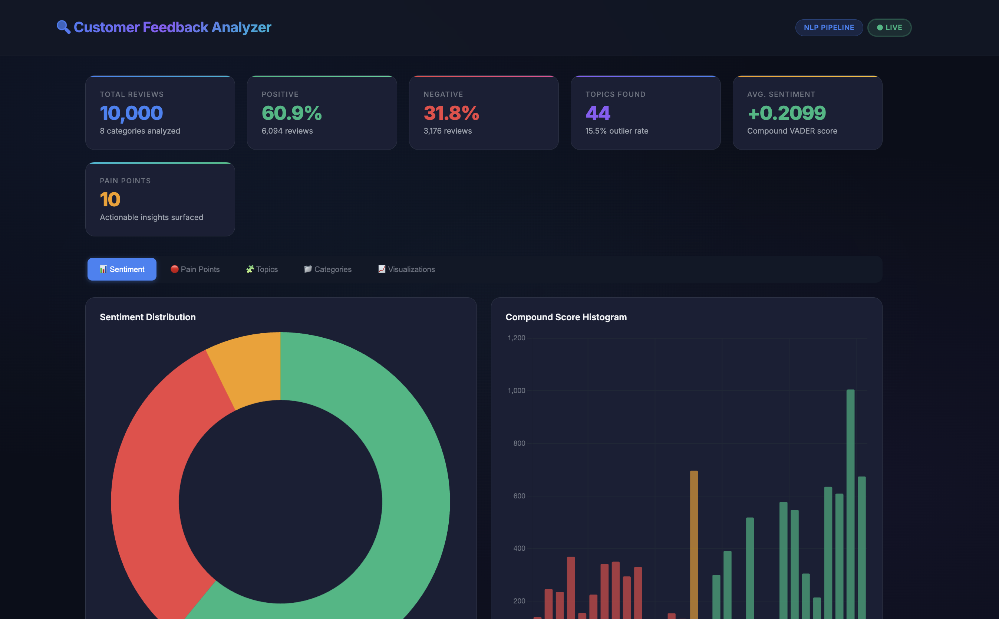
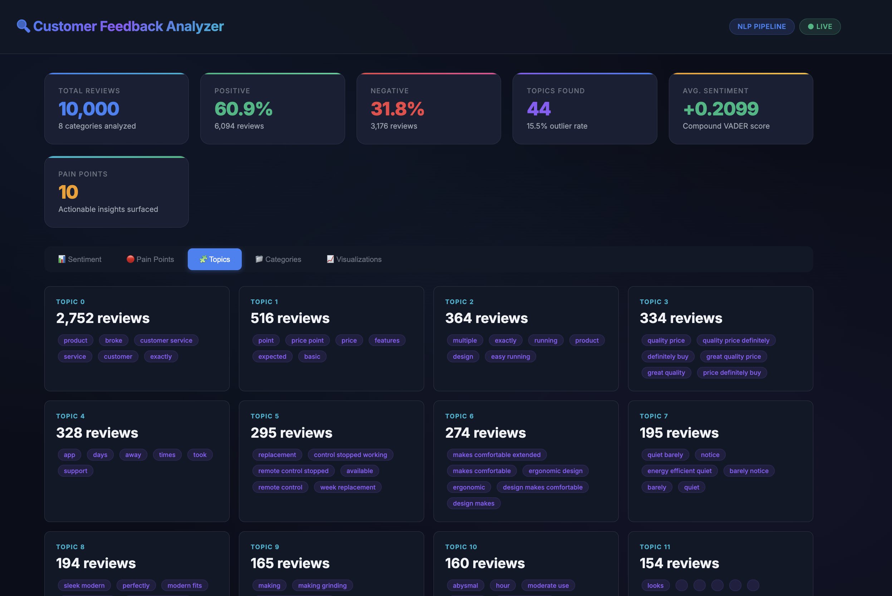
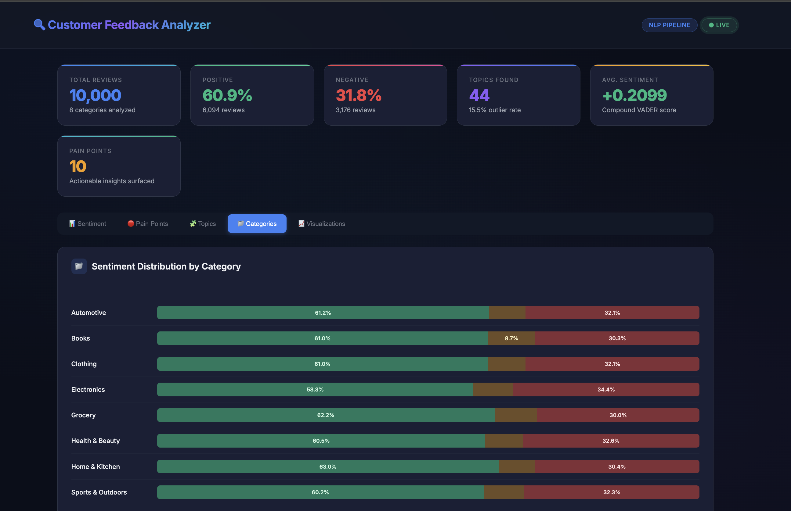

# 🔍 NLP-Based Customer Feedback Analyzer

> **NLP pipeline over 10,000+ reviews** — VADER sentiment analysis + BERTopic clustering on TF-IDF embeddings to surface actionable pain points from behavioral feedback data.


## 📋 Overview

This project implements a production-grade NLP pipeline that processes large-scale customer feedback data to extract sentiment patterns and discover latent topic clusters. The system combines **rule-based sentiment analysis** (VADER) with **neural topic modeling** (BERTopic with c-TF-IDF) to deliver actionable business insights from unstructured text data.

## 🖥️ Dashboard Screenshots

### Sentiment Analysis — KPIs, Distribution & Compound Score Histogram


### Topic Clusters — BERTopic Discovered Themes with Keyword Tags


### Category Breakdown — Sentiment Distribution Across Product Categories


## 🏗️ Architecture

```
┌─────────────────────────────────────────────────────────┐
│                   Data Ingestion Layer                    │
│  ┌─────────┐  ┌──────────┐  ┌────────────────────────┐  │
│  │ Raw CSV │→ │ Cleaner  │→ │ Preprocessed DataFrame │  │
│  └─────────┘  └──────────┘  └────────────────────────┘  │
├─────────────────────────────────────────────────────────┤
│                  NLP Processing Pipeline                  │
│  ┌──────────────┐      ┌──────────────────────────────┐  │
│  │    VADER     │      │        BERTopic              │  │
│  │  Sentiment   │      │  ┌────────┐  ┌───────────┐  │  │
│  │  ├─compound  │      │  │  UMAP  │→ │  HDBSCAN  │  │  │
│  │  ├─positive  │      │  └────────┘  └───────────┘  │  │
│  │  ├─negative  │      │       ↓           ↓         │  │
│  │  └─neutral   │      │  ┌──────────────────────┐   │  │
│  └──────────────┘      │  │  c-TF-IDF Repr.      │   │  │
│                        │  └──────────────────────┘   │  │
│                        └──────────────────────────────┘  │
├─────────────────────────────────────────────────────────┤
│                  Analysis & Visualization                 │
│  ┌────────────┐ ┌──────────────┐ ┌───────────────────┐  │
│  │ Sentiment  │ │ Topic Cluster│ │  Pain Point       │  │
│  │ Dashboard  │ │ Heatmaps     │ │  Extraction       │  │
│  └────────────┘ └──────────────┘ └───────────────────┘  │
└─────────────────────────────────────────────────────────┘
```

## 🚀 Quick Start

### Prerequisites
- Python 3.9+
- pip

### Installation

```bash
# Clone the repository
git clone https://github.com/yourusername/feedback-analyzer.git
cd feedback-analyzer

# Create virtual environment
python -m venv venv
source venv/bin/activate  # macOS/Linux

# Install dependencies
pip install -r requirements.txt
```

### Usage

```bash
# Step 1: Run the full NLP pipeline (generates data + runs all stages)
python src/pipeline.py

# Step 2: Launch interactive dashboard
python src/dashboard.py
# → http://127.0.0.1:5000

# Optional: Run individual stages
python src/data_generator.py    # Generate 10K+ synthetic reviews
python src/pipeline.py --skip-data   # Re-run pipeline with existing data
python src/pipeline.py --skip-topics # Sentiment-only mode (no BERTopic)
```

## 📊 Key Results

| Metric | Value |
|---|---|
| Reviews Processed | **10,000** |
| Sentiment Distribution | 60.9% positive · 31.8% negative · 7.3% neutral |
| VADER vs Star-Rating Agreement | **69.3%** |
| Topics Discovered | **44 clusters** |
| Outlier Rate (Topic -1) | 15.5% |
| Pain Points Surfaced | **10 actionable insights** |
| Mixed-Sentiment Reviews | 18.2% |
| Pipeline Throughput | ~9,100 reviews/sec (VADER) |
| Total Pipeline Runtime | **34.8s** (end-to-end) |

## 📁 Project Structure

```
feedback-analyzer/
├── README.md
├── requirements.txt
├── config.yaml
├── UI-Images/                     # Dashboard screenshots
│   ├── image.png                  # Sentiment KPIs & charts
│   ├── image-2.png                # Category breakdown
│   └── image-3.png                # Topic clusters
├── src/
│   ├── __init__.py
│   ├── data_generator.py          # Synthetic review generation (10K+)
│   ├── preprocessor.py            # Text cleaning & normalization
│   ├── sentiment.py               # VADER sentiment analysis
│   ├── topic_model.py             # BERTopic + c-TF-IDF clustering
│   ├── pain_points.py             # Actionable insight extraction
│   ├── pipeline.py                # End-to-end pipeline orchestrator
│   └── dashboard.py               # Interactive visualization server
├── data/                          # Generated at runtime
│   ├── raw_reviews.csv
│   └── processed_reviews.csv
├── outputs/                       # Analysis results & plots
│   ├── sentiment_results.csv
│   ├── topic_results.csv
│   ├── topic_summary.json
│   ├── pain_points.json
│   ├── bertopic_model/
│   └── plots/
└── .gitignore
```

## 🔧 Configuration

Edit `config.yaml` to customize pipeline behavior:

```yaml
data:
  n_reviews: 10000
  random_seed: 42

sentiment:
  compound_threshold_pos: 0.05
  compound_threshold_neg: -0.05

topic_model:
  min_topic_size: 50
  n_gram_range: [1, 3]
  nr_topics: "auto"
```

## 📜 License

MIT License — see [LICENSE](LICENSE) for details.
